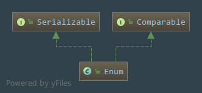

# java.lang.Enum浅析

## 一. Enum类的声明
```java
public abstract class Enum<E extends Enum<E>>
        implements Comparable<E>, Serializable{}
```  

  

 - `Enum`类是一个抽象类,需要有实现类
 - 使用了泛型,限定了只能是个`Enum`类型
 - 实现了**Comparable**接口,说明它是可以进行比较的,但是限定了智能跟**Enum**类型进行比较,愿意就是在实现**Comparable**接口的时候使用了**泛型**,进行比较的方法`compareTo(T o)`是根据传入的泛型作为比较的参数的,所以限定了`compareTo()`只能比较`Enum`类型
 - 实现了可序列化接口,说明是支持序列化以及反序列化的
 - `JDK1.5`的新特性
 
##  二. 构造方法
就一个构造方法,注意的是修饰符是`protected`,传入枚举名字跟序号,不过这里是没有办法通过构造方法实例化
```java
protected Enum(String name, int ordinal) {
        this.name = name;
        this.ordinal = ordinal;
    }
```
##  三. `Enum`的属性
- 枚举常量的名字,注释上写着`建议程序员多使用toString()方法,少使用这个字段`
```java
 private final String name;
```
- 枚举常量的序数,很多的程序员是不使用这个属性的
```java
private final int ordinal;
```
## 四. 方法都是些比较常见的
- 返回枚举的名字
```java
public final String name() {
        return name;
    }
```
- 返回枚举的序号
```java
public final int ordinal() {
        return ordinal;
    }
```
- 返回枚举的名字
```java
public String toString() {
        return name;
    }
```
- equals
```java
public final boolean equals(Object other) {
        return this==other;
    }
```
- hashCode
```java
public final int hashCode() {
        return super.hashCode();
    }
```
- clone方法,这里的修饰符是`protected`,可以保证枚举是不能被`clone`的,单例
```java
protected final Object clone() throws CloneNotSupportedException {
        throw new CloneNotSupportedException();
    }
```

- compareTo方法,用于跟别的类型进行比较,泛型限制了传入的就是枚举类型,返回的是一个`int`类型的值,就是使用两个枚举的序号进行相减,也就是使用数量进行相减操作,相等就返回0,不相等就不等于0
```java
public final int compareTo(E o) {
        Enum<?> other = (Enum<?>)o;
        Enum<E> self = this;
        if (self.getClass() != other.getClass() && // optimization
            self.getDeclaringClass() != other.getDeclaringClass())
            throw new ClassCastException();
        return self.ordinal - other.ordinal;
    }
```
- getDeclaringClass方法,返回两个枚举常量的类型是否相等,相等返回`true`,不相等返回`false`
```java
 @SuppressWarnings("unchecked")
    public final Class<E> getDeclaringClass() {
        Class<?> clazz = getClass();
        Class<?> zuper = clazz.getSuperclass();
        return (zuper == Enum.class) ? (Class<E>)clazz : (Class<E>)zuper;
    }
```

- valueOf方法,返回指定枚举常量的类型跟名字,返回一个枚举名字
````java
public static <T extends Enum<T>> T valueOf(Class<T> enumType,
                                                String name) {
        T result = enumType.enumConstantDirectory().get(name);
        if (result != null)
            return result;
        if (name == null)
            throw new NullPointerException("Name is null");
        throw new IllegalArgumentException(
            "No enum constant " + enumType.getCanonicalName() + "." + name);
    }
````

- finalize方法,修饰符是`protected`,就是不能被调用了
```java
protected final void finalize() { }
```

- readObject方法,防止默认的反序列化,私有的方法
```java
private void readObject(ObjectInputStream in) throws IOException,
        ClassNotFoundException {
        throw new InvalidObjectException("can't deserialize enum");
    }
    
    
```
- readObjectNoData方法,同上
```java
private void readObjectNoData() throws ObjectStreamException {
        throw new InvalidObjectException("can't deserialize enum");
    }
```


 