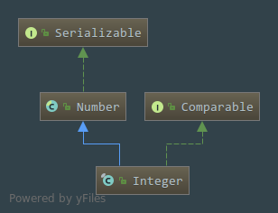

# java.lang.Integer浅析

## 一. Integer类的声明
```java
public final class Integer extends Number implements Comparable<Integer>{}
```
  
  - Integer是一个**Final**类,也就是不可变的类
  - 继承了**Number**这个抽象类,拥有了父类的一系列方法,同时也隐式的实现了**Serializable**接口
  - 实现了**Comparable**接口,说明它是可以进行比较的,但是限定了智能跟**Integer**类型进行比较,愿意就是在实现**Comparable**接口的时候使用了**泛型**,进行比较的方法`compareTo(T o)`是根据传入的泛型作为比较的参数的,所以限定了`compareTo()`只能比较`INteger`类型

## 二. 特殊的内部类
- 自动缓存`-128`到`127`之间的整数,这个缓存将会在第一次使用时被初始化,缓存的大小受`JVM`运行参数-XX:AutoBoxCacheMax=<size>`控制,可以通过这个进行更改
```java
private static class IntegerCache {
        static final int low = -128;
        static final int high;
        static final Integer cache[];

        static {
            // high value may be configured by property
            int h = 127;
            String integerCacheHighPropValue =
                sun.misc.VM.getSavedProperty("java.lang.Integer.IntegerCache.high");
            if (integerCacheHighPropValue != null) {
                try {
                    int i = parseInt(integerCacheHighPropValue);
                    i = Math.max(i, 127);
                    // Maximum array size is Integer.MAX_VALUE
                    h = Math.min(i, Integer.MAX_VALUE - (-low) -1);
                } catch( NumberFormatException nfe) {
                    // If the property cannot be parsed into an int, ignore it.
                }
            }
            high = h;

            cache = new Integer[(high - low) + 1];
            int j = low;
            for(int k = 0; k < cache.length; k++)
                cache[k] = new Integer(j++);

            // range [-128, 127] must be interned (JLS7 5.1.7)
            assert IntegerCache.high >= 127;
        }

        private IntegerCache() {}
    }
    
```
直接上栗子,默认情况下是这样的:
```java
        Integer integer1 = 127;
        Integer integer2 = 127;
        System.out.println(integer1 == integer2);     // true 

        Integer integer3 = 128;
        Integer integer4 = 128;
        System.out.println(integer3 == integer4);     // false 

        Integer integer5 = -128;
        Integer integer6 = -128;
        System.out.println(integer5 == integer6);     // true 

        Integer integer7 = -129;
        Integer integer8 = -129;
        System.out.println(integer7 == integer8);          // flase 
```
然后如果我们还想让它缓存更大的数的话就给`JVM`设置一个运行参数,这里假如我设置到最大缓存到**256**,`-XX:AutoBoxCacheMax=256`
```java
        Integer integer1 = 256;
        Integer integer2 = 256;
        System.out.println(integer1 == integer2);     // true

        Integer integer3 = 257;
        Integer integer4 = 257;
        System.out.println(integer3 == integer4);      // false 超过了最大缓存就比较地址了,没有缓存可以取了
```
## 三. Integer的属性
- ①.定义了一个**最小值**,是`2^-31`,换算过来就是`-2147483648`,因为是个静态属性,可以直接通过`Integer.MIN_VALUE`取到
```java
    //  A constant holding the minimum value an {@code int} can have, -2^31
    @Native public static final int   MIN_VALUE = 0x80000000;
```
---
- ②.定义一个**最大值**,是`2^31`,换算过来就是`2147483647`,因为是个静态属性,可以直接通过`Integer.MAX_VALUE`取到
````java
    // A constant holding the maximum value an  int can have, 2^31-1.
   @Native public static final int   MAX_VALUE = 0x7fffffff;
````
---
- ③.得到`Integer`的类型,根据方法注释我们可以知道是`Integer`类型的`Type`是一个基本类型
```java
 /**
     * The  Class instance representing the primitive type int.
     * @since   JDK1.1
     */
    @SuppressWarnings("unchecked")
    public static final Class<Integer>  TYPE = (Class<Integer>) Class.getPrimitiveClass("int");
```
然后我们这里就会引发一个疑问了,为什么`Integer`的`Type`会是`in.class`呢？,这里我们其实可以像个栗子：
```java
        System.out.println(Integer.TYPE);                        //  int 
        // 使用 == 进行比较
        System.out.println(Integer.TYPE == int.class);          // true
        System.out.println(Integer.class == int.class);         // false
        // 如果还想更加准确地比较,可以使用System.identityHashCode()产生一个哈希码,这个是给予地址生成的,不是给予内容
        System.out.println(System.identityHashCode(Integer.TYPE));      //  2061475679
        System.out.println(System.identityHashCode(int.class));        //  2061475679
        System.out.println(System.identityHashCode(Integer.class));    //   410424423
```
这里我们可以很清楚的得到理论就是:  
   1.  `Integer.TYPE`跟`int.class`是相等的,因为`Integer.TYPE`这个常量就是通过`Class.getPrimitiveClass("int")`得到的.
   2.  `Integer.class`跟`int.class`是不相等的,因为`Integer.class`是个包装类,我们可以看到它的源码,`int.class`的源码我就不知道去哪里看了  
---

- ④.列举出所有可能作为数字的字母,每个字母对应着`ASCII`码,是可以进行转换的,给方法内部使用的
```java
     //  All possible chars for representing a number as a String
    final static char[] digits = {
        '0' , '1' , '2' , '3' , '4' , '5' ,
        '6' , '7' , '8' , '9' , 'a' , 'b' ,
        'c' , 'd' , 'e' , 'f' , 'g' , 'h' ,
        'i' , 'j' , 'k' , 'l' , 'm' , 'n' ,
        'o' , 'p' , 'q' , 'r' , 's' , 't' ,
        'u' , 'v' , 'w' , 'x' , 'y' , 'z'
    };
```
---
-  ⑤.`private final int value`代表的就是`Integer`的值  
---
- ⑥. 用二进制补码表示`int`的比特位数
`@Native public static final int SIZE = 32;`
---
- ⑦.用二进制补码表示`int`的字节位数(JDK1.8)
`public static final int BYTES = SIZE / Byte.SIZE;`
---
- ⑧. 相加两个数(JDK1.8)
```java
public static int sum(int a, int b) {
        return a + b;
    }
```
---
- ⑨. 比较2个数,并返回最大数(JDK1.8)
```java
 public static int max(int a, int b) {
        return Math.max(a, b);
    }
```
---
- ⑩.比较两个数,并返回最小的那个数(JDK1.8)
```java
public static int min(int a, int b) {
        return Math.min(a, b);
    }
```
## 四. 构造方法
- 传入一个`int`类型的值
```java
public Integer(int value) {
        this.value = value;
    }
```
---
- 传入一个`String`类型的数字
```java
public Integer(String s) throws NumberFormatException {
        this.value = parseInt(s, 10);
    }
```

## 五.Integer的方法
- toString()方法,也重写了`Object`的`toString()`方法
```java
public static String toString(int i, int radix) {
        if (radix < Character.MIN_RADIX || radix > Character.MAX_RADIX)
            radix = 10;

        /* Use the faster version */
        if (radix == 10) {
            return toString(i);
        }

        char buf[] = new char[33];
        boolean negative = (i < 0);
        int charPos = 32;

        if (!negative) {
            i = -i;
        }

        while (i <= -radix) {
            buf[charPos--] = digits[-(i % radix)];
            i = i / radix;
        }
        buf[charPos] = digits[-i];

        if (negative) {
            buf[--charPos] = '-';
        }

        return new String(buf, charPos, (33 - charPos));
    }
```
---
- 转变成一个无符号的`String`类型
```java
 public static String toUnsignedString(int i, int radix) {
        return Long.toUnsignedString(toUnsignedLong(i), radix);
    }
```
---
- 传入一个文本型的数字转为`Integer`类型
```java
public static Integer valueOf(String s) throws NumberFormatException {
        return Integer.valueOf(parseInt(s, 10));
    }
```
---
- 手动装箱,把一个`基本数据类型转为包装类型
```java
public static Integer valueOf(int i) {
        if (i >= IntegerCache.low && i <= IntegerCache.high)
            return IntegerCache.cache[i + (-IntegerCache.low)];
        return new Integer(i);
    }
```
---
- 转换为基本数据类型
```java
 public byte byteValue();
 public short shortValue();
 public int intValue();
 public long longValue();
 public float floatValue();
 public double doubleValue();
```
- `toString()`方法
```java
public String toString() {
        return toString(value);
    }
```
---
- `equals()`方法
```java
public boolean equals(Object obj) {
        if (obj instanceof Integer) {
            return value == ((Integer)obj).intValue();
        }
        return false;
    }
```
---
- 将`String`转为`Integer`类型
```java
Integer getInteger(String nm);
Integer getInteger(String nm, int val);
Integer getInteger(String nm, Integer val);
Integer decode(String nm);
Integer valueOf(String s);
Integer valueOf(String s, int radix);
````
---
- 将`String`转为`int`类型
```java
int parseUnsignedInt(String s);
int parseUnsignedInt(String s, int radix);
int parseInt(String s);
int parseInt(String s, int radix);
```
---
- 跟另外一个`Integer`类型比较
```java
public int compareTo(Integer anotherInteger) {
        return compare(this.value, anotherInteger.value);
    }
```
---
- 传入两个`int`类型的数字进行比较
```java
public static int compare(int x, int y) {
        return (x < y) ? -1 : ((x == y) ? 0 : 1);
    }
```

- 传入两个无符号类型的数字进行比较
```java
 public static int compareUnsigned(int x, int y) {
        return compare(x + MIN_VALUE, y + MIN_VALUE);
    }
```

- 转换为`Long`类型无符号
```java
public static long toUnsignedLong(int x) {
        return ((long) x) & 0xffffffffL;
    }
```

