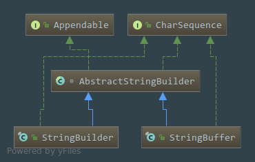

# java.lang.String浅析
## String类的声明
````java
public final class String
    implements java.io.Serializable, Comparable<String>, CharSequence{} 
````

 - `String`类是`Final`类型的,不可变的类,所以是不能被继承的
 - 实现`Serializable`接口说明是支持被序列化以及反序列化
 - 实现`Comparable`接口说明`String`支持被排序
 - 实现`CharSequence`接口是一个可读序列
 - 同时在实现接口的时候使用到了`JDK1.5`的新特性`泛型`
## String类的属性
````java
 /** The value is used for character storage. */
    private final char value[];
````
从这里我们可以看出这是一个`Final`修饰的`character`类型数组,由此我们可以想到`String`不可变的性质应该跟这个有关了,然后`String`也还是**字符数组**
```java
 /** Cache the hash code for the string */
    private int hash; // Default to 0
```
缓存字符串的`HashCode`,默认是为0
```java
 /** use serialVersionUID from JDK 1.0.2 for interoperability */
    private static final long serialVersionUID = -6849794470754667710L;
```
`serialVersionUID`翻译过中文来就是`序列化ID`,在反序列化的时候`JVM`要比较从某种途径传递过来的`字节流`中的`serialVersionUID`跟本地类文件中的`serialVersionUID`是否一制,如果不一致就会反序列化失败
```java
 /**
     * Class String is special cased within the Serialization Stream Protocol.
     * A String instance is written into an ObjectOutputStream according to
     * Object Serialization Specification, Section 6.2, "Stream Elements"</a>
     */
private static final ObjectStreamField[] serialPersistentFields =
        new ObjectStreamField[0];
```
这个属性看名字的话就是跟反序列化有关的,就是说一个String实例来源于输入的字节流中,也就是反序列化中的字节流

## String类的构造方法
  ### 一.  无参的构造方法
  ```java
/**
     * Initializes a newly created  String object so that it represents
     * an empty character sequence.  Note that use of this constructor is
     * unnecessary since Strings are immutable.
     */
    public String() {
        this.value = "".value;
    }
```
当实例化一个`String`对象没有传参数的话,默认就会赋值**一个空白的字符串**,请注意这里不是`NULL`,`String`
```java
   new String()==null   // 这里得到的是false
```

### 传入`String`类型的值实例化,这里初始化流程就是直接把传入的源`String`类型的值中`value`跟`hash`复制给目标`String`类型
 ```java
    public String(String original) {
        this.value = original.value;
        this.hash = original.hash;
    }
    // 这个构造方法就是等于
     String str = new String();     // 直接无参数实例化一个String对象
     String str = new String("");   // 传入一个String类型的值作为参数实例化一个String对象
     // 这两种写法都是可以被编译的,在IDEA中你这样写的话它就会直接提示你这样的方式是多余的，会直接提示你可以优化成下面这种
     String str = "";
     
```
  _这里我又想起来了一个面试题,题目为
  > String str= new String("abc")这里创建了几个对象  
  
  按照我们以往的思路,实例化一个对象有两种方式  
  
  1.直接`new`一个对象出来,例如   A a=new A();  
  
  2.通过反射调用`Class`的`newInstance()`方法创建例如 A a=A.class.newInstance();  
  
  在这道题目中很显然是使用`new`对象的方式创建的,调用的是传入一个`String`类型的字符串进行构建,然后实例化的对象的引用复制给`str`这个变量,所以很显然就等同于有两个对象,所以这里的话应该这样回答比较好一点:
  > 这里涉及到了**2**个`String`对象
  
  一个是`abc`这个字符串驻留在全局共享的字符串常量池里面的实例对象,另一个是`new String()`创建并初始化的,内容跟`abc`一致的实例.直接在`IDEA`里面测试:
  
  
  我们可以留意到这里是有个`char[]`,我们这里并没有显示的出现数组,但是这里却出现了,由此我们应该可以想到,这应该就是构成`String`内容的字符数组了
  

### 只传入一个数组对象,使用这种方法创建String的话,这里会调用` Arrays.copyOf()`方法,` Arrays.copyOf()`方法返回的是`char[]`数组,所以作用就是把这个数组里面的内容复制到`String`的字符串数组里面去
   ```java
   public String(char value[]) {
           this.value = Arrays.copyOf(value, value.length);
       }
   ```
   - 这里还可以传入一个数组指定部分内容去构造一个`String`对象,在传入一个数组对象时,同时传入两个`int`类型的下标,其中`offset`为开始的下标位置,`count`为截取几个数量的数组内容
   ````java
   public String(char value[], int offset, int count) {
           if (offset < 0) {
               // 起始位置小于0的话,肯定就是下标越界，也就是不正确了
               throw new StringIndexOutOfBoundsException(offset);
           }
           if (count <= 0) {
               if (count < 0) {
                  //  截取的内容长度小于0必定也是下标越界
                   throw new StringIndexOutOfBoundsException(count);
               }
               if (offset <= value.length) {
                   this.value = "".value;
                   return;
               }
           }
           // Note: offset or count might be near -1>>>1.
           if (offset > value.length - count) {
               //  起始的位置 > 总长度 - 截取的下标长度 ,这里就是属于截取长度超出数组的总长度了
               throw new StringIndexOutOfBoundsException(offset + count);
           }
           // 复制数组的部分内容到新的数组中
           this.value = Arrays.copyOfRange(value, offset, offset+count);
       }
   ````
### 使用字节数组构建,不过一般更少这样使用,个人感觉,在这里需要注意的是参数`charsetName`跟`charset`,只要传入了这两个参数中的一个的话,就会调用`StringCoding.decode()`这个方法进行解码,然后把`byte[]`转成`char[]`,所以这里纪要特别注意编码的问题,特别是我们的汉字,很多时候老外都是用英文的,所以编码很多时候都不用改,而我们如果有中文还要选择合适的编码进行解码,如果没有明确地指出编码的话,默认是使用`ISO-8859-1`进行解码的
```java
    // 这种方法已经不建议被使用了
    @Deprecated
    public String(byte ascii[], int hibyte, int offset, int count){};

    @Deprecated
    public String(byte ascii[], int hibyte){};
    
    // 传入字节数组,指定起始的下标,截取几个下标长度,指定(charset)编码来进行转换,下面集中方法也差不多,这是重载下适应不同情况下的调用
    public String(byte bytes[], int offset, int length, String charsetName){};
    
     public String(byte bytes[], int offset, int length, Charset charset){};
     
     public String(byte bytes[], String charsetName);
     
     public String(byte bytes[], Charset charset);
     
     public String(byte bytes[], int offset, int length);
     
     public String(byte bytes[]);
```
默认的把`byte[]`字节数组转成`char[]`字符数组的方法
```java
  static char[] decode(byte[] ba, int off, int len) {
        String csn = Charset.defaultCharset().name();
        try {
            // use charset name decode() variant which provides caching.
            return decode(csn, ba, off, len);
        } catch (UnsupportedEncodingException x) {
            warnUnsupportedCharset(csn);
        }
        try {
            // 请注意这里的“ISO-8859-1”,这是默认的编码
            return decode("ISO-8859-1", ba, off, len);
        } catch (UnsupportedEncodingException x) {
            // If this code is hit during VM initialization, MessageUtils is
            // the only way we will be able to get any kind of error message.
            MessageUtils.err("ISO-8859-1 charset not available: "
                             + x.toString());
            // If we can not find ISO-8859-1 (a required encoding) then things
            // are seriously wrong with the installation.
            System.exit(1);
            return null;
        }
    }
```

### 使用`StringBuffer`跟`StringBuilder`进行构建,既然都已经用了这两个对象了,直接调用这两个对象都有的`toString()`方法,这两个对象都重写了`toString()`方法,得到的就是一个`String`对象
```java
  // 这里使用synchronized同步buffer这个对象,是线程安全的，缺点是速度会更慢一点
 public String(StringBuffer buffer) {
        synchronized(buffer) {
            this.value = Arrays.copyOf(buffer.getValue(), buffer.length());
        }
    }
    
  // StringBuilder是线程不安全的，优点是速度会更快一点
 public String(StringBuilder builder) {
         this.value = Arrays.copyOf(builder.getValue(), builder.length());
     }

```

### 返回一个值的长度
```java
 public int length() {
        return value.length;
    }
```
### 判断一个值是否为空,就是判断长度是否为**0**,为**0**就返回`false`
```java
public boolean isEmpty() {
        return value.length == 0;
    }
```

### 传入一个下标,如果这个下标对应的值是存在的话返回一个下标对应的字符值,否则就抛出下标越界异常
```java
public char charAt(int index) {
        if ((index < 0) || (index >= value.length)) {
            throw new StringIndexOutOfBoundsException(index);
        }
        return value[index];
    }
```
### 把一个`String`对象转换为`byte[]`字节数组,然后常用的分为三个方法
```java
   // 直接传入编码的名字就可以进行转换了
   public byte[] getBytes(String charsetName);

   // 传入一个字符集Charset,这是在java.nio包中的一个类
   public byte[] getBytes(Charset charset);
   
   // 按照默认的编码就行转换 
   public byte[] getBytes();
```

### 判断两个对象的值是否相等,这里只要传入不是`String`对象必定返回**false**,这个方法的源码还是挺好的,我们写代码的时候其实肯定会碰到这个判断的情况,我们就可以把发生概率最高的那个可能尽可能地放到前面去,可以减少判断的次数
```java

public boolean equals(Object anObject) {
    // 如果对象的内存地址都相等的那肯定值也相等了,
        if (this == anObject) {
            return true;
        }
        // 如果对象是String的一个实例的话才有可能相等
        if (anObject instanceof String) {
            // 强转为String类型
            String anotherString = (String)anObject;
            // 得到被比较值的长度,也就是调用equals方法的对象
            int n = value.length;
            // 如果比较的对象的长度相等则继续进行比较,不相等的话就肯定不相等了
            if (n == anotherString.value.length) {
                // 把要被比较的对象转成字符数组
                char v1[] = value;
                // 把比较的那个对象也转换成字符数组
                char v2[] = anotherString.value;
                int i = 0;
                // 这里就是把被比较值的长度进行自减,等于0就肯定是就已经遍历完了被比较每一个字符
                while (n-- != 0) {
                    // 这里i是从0开始的,也就是两个字符数组都是从第一个下标代表的值进行比较,只要有一个不匹配就返回false
                    if (v1[i] != v2[i])
                        return false;
                    // i是一直在增加的,只要被比较的数长度n没有减到0就一直增加
                    i++;
                }
                // 上面这个while循环没有返回false就肯定是全部匹配成功了
                return true;
            }
        }
        // 都不是String的实例那肯定就不相等了
        return false;
    }
```
### 跟实现了`CharSequence`接口的类实例化出来的对象进行比较,这个方法跟`equals()`方法最大的区别就是它比较的范围更加广,而且`equals()`方法只有可能跟`String`方法比较才有可能返回**true**,但是这个方法就不一定了
```java
     // 跟StringBuffer类型对象进行比较,调用的还是下面这个方法,只不过是先把StringBuffer对象强转为CharSequence对象
    public boolean contentEquals(StringBuffer sb) {
            return contentEquals((CharSequence)sb);
        }
```
下面这个方法才是真正进行比较的方法,这里上一张`AbstractStringBuilder`的UML图,主要更清楚地看到哪些类继承了它,以及它实现的接口,我们可以很明显地看到它实现了`CharSequence`接口,然后它的实现类有两个:`StringBuffer`跟`StringBuilder`,然后我们可以看下面的代码了:  
  
```java

    public boolean contentEquals(CharSequence cs) {
            // 先判断对象是不是AbstractStringBuilder的实例
            if (cs instanceof AbstractStringBuilder) {
                // 判断是否是StringBuffer的实例,然后是跟不是都会强转为AbstractStringBuilder类型,然后这里就有个区别了
                // 因为StringBuffer是高效率,线程不安全的,所以要进行同步,所以如果对象是StringBuffer的实例就会在同步的环境下执行
                if (cs instanceof StringBuffer) {
                    synchronized(cs) {
                       return nonSyncContentEquals((AbstractStringBuilder)cs);
                    }
                } else {
                    //如果不是StringBuffer的实例话,就直接直接nonSyncContentEquals()这个方法
                    return nonSyncContentEquals((AbstractStringBuilder)cs);
                }
            }
            // 这里就很好理解了,如果是String的实例就直接调用equals()方法进行比较
            if (cs instanceof String) {
                return equals(cs);
            }
            // 如果对象是一个CharSequence的实例的话那就先比较长度,长度不相等就不相等
            char v1[] = value;
            int n = v1.length;
            if (n != cs.length()) {
                return false;
            }
            for (int i = 0; i < n; i++) {
                // 循环判断被比较字符数组下标对应的值是否在比较对象里面,有一个没有就是不相等
                if (v1[i] != cs.charAt(i)) {
                    return false;
                }
            }
            return true;
        }
``` 
接下来这个方法才算是那个藏在背后的审判员,我们可以发现这几个比较方法核心代码都是差不多的
 ```java
      // 不适用同步的进行比较,这个方法主要是比较AbstractStringBuilder的实例
        private boolean nonSyncContentEquals(AbstractStringBuilder sb) {
                char v1[] = value;
                char v2[] = sb.getValue();
                int n = v1.length;
                if (n != sb.length()) {
                    return false;
                }
                for (int i = 0; i < n; i++) {
                    if (v1[i] != v2[i]) {
                        return false;
                    }
                }
                return true;
            }
```       
说完这几个判断相等的方法直接上个例子:
```java
        String s1 = "hello";
        String s2 = new String("hello");
        StringBuffer sb = new StringBuffer("hello");
        StringBuilder sb2=new StringBuilder("hello");
        System.out.println(s1.equals(s2));          //  true,因为值是相等的.
        System.out.println(s1.equals(sb));          //  false, String的equals()只要比较的不是String对象必定返回false.
        System.out.println(s1.equals(sb2));         //  false, String的equals()只要比较的不是String对象必定返回false.
        System.out.println(s1.contentEquals(sb));   //  true,  因为两者的值相等的,而且是跟StringBuffer比较,按照nonSyncContentEquals()方法流程执行下来就是true.
        System.out.println(s1.contentEquals(sb2));  //  true,两者的值是相等的,然后StringBuilder也实现了AbstractStringBuilder对象,所以一样是会执行到nonSyncContentEquals()方法,执行下来就是true.
```
### 忽略大小写进行比较,这个方法就是运用了三木运算符进行比较,一眼看上去很简洁,但是要自己理解下,首先判断地址相等的话就是直接返回**true**的,然后右边还有个长长的**短路与**表达式,比较的`String`对象为空就返回**false**,继续比较两个对象的长度是否一样,不一样返回**false**,最后就是调用`regionMatches()`这个方法得到一个方法的返回值来得到最终的结果,最终的忽略大小写比较是在`regionMatches()`方法里面
```java
public boolean equalsIgnoreCase(String anotherString) {
        return (this == anotherString) ? true
                : (anotherString != null)
                && (anotherString.value.length == value.length)
                && regionMatches(true, 0, anotherString, 0, value.length);
    }
```
### 判断是否以某个前缀开头或者结尾
```java
// 指定开始的下标,然后指定前缀查看是否是这个开始
   public boolean startsWith(String prefix, int toffset) {
           char ta[] = value;
           int to = toffset;
           char pa[] = prefix.value;
           int po = 0;
           int pc = prefix.value.length;
           // Note: toffset might be near -1>>>1.
           if ((toffset < 0) || (toffset > value.length - pc)) {
               return false;
           }
           while (--pc >= 0) {
               if (ta[to++] != pa[po++]) {
                   return false;
               }
           }
           return true;
       }
    // 直接判断是否以这个开头
  public boolean startsWith(String prefix) {
          return startsWith(prefix, 0);
      } 
    // 判断是否以这个结尾  
  public boolean endsWith(String suffix) {
         return startsWith(suffix, value.length - suffix.value.length);
     }
    
```

### hashCode,产生对象的哈希码,这里是一个数学计算样的,用于产生不冲突的哈希码
```java
public int hashCode() {
        int h = hash;
        if (h == 0 && value.length > 0) {
            char val[] = value;

            for (int i = 0; i < value.length; i++) {
                h = 31 * h + val[i];
            }
            hash = h;
        }
        return h;
    }
```

### 返回一个字符在字符串中的索引未知,返回的位置为第一次出现的
```java
// 直接在字符串中搜索字符出现的位置
public int indexOf(int ch) {
        return indexOf(ch, 0);
    }
 // 从指定索引位置开始搜索指定字符所在的位置   
public int indexOf(int ch, int fromIndex) {
        final int max = value.length;
        if (fromIndex < 0) {
            fromIndex = 0;
        } else if (fromIndex >= max) {
            // Note: fromIndex might be near -1>>>1.
            return -1;
        }

        if (ch < Character.MIN_SUPPLEMENTARY_CODE_POINT) {
            // handle most cases here (ch is a BMP code point or a
            // negative value (invalid code point))
            final char[] value = this.value;
            for (int i = fromIndex; i < max; i++) {
                if (value[i] == ch) {
                    return i;
                }
            }
            return -1;
        } else {
            return indexOfSupplementary(ch, fromIndex);
        }
    }    
    
```

### 返回一个字符串最后一次出现的位置
```java
    // 不指定起始位置搜索最后一次出现的位置
    public int lastIndexOf(int ch) {
            return lastIndexOf(ch, value.length - 1);
        }
     // 指定一个起始位置进行搜索字符在字符串中出现的位置,如果不存在就返回-1
    public int lastIndexOf(int ch, int fromIndex);

    // 下面这几个方法都是差不多的用法
    static int lastIndexOf(char[] source, int sourceOffset, int sourceCount,
            String target, int fromIndex);
    
    static int lastIndexOf(char[] source, int sourceOffset, int sourceCount,
                char[] target, int targetOffset, int targetCount,
                int fromIndex);
    
```

### 截取字符串,文档给出的例子,也挺好理解的,一个是只指定开启截取的位置,一个是指定开始的位置同时指定结束的位置
```java
    /*    
     *     "unhappy".substring(2) returns "happy"
     *     "Harbison".substring(3) returns "bison"
     *     "emptiness".substring(9) returns "" (an empty string)
     */
   public String substring(int beginIndex);
   
   /**
   *      "hamburger".substring(4, 8) returns "urge"
   *       "smiles".substring(1, 5) returns "mile"
   */
   public String substring(int beginIndex, int endIndex);
```
### 这个算是拼接字符串了,值得注意的是这个方法需要注意的地方在传入的对象为空的话默认是返回源对象的,例如：
 "to".concat("get").concat("her") 返回的是"together"
```java

public String concat(String str) {
        int otherLen = str.length();
        if (otherLen == 0) {
            // 如果传入的对象长度为0就肯定是空了,直接返回源对象
            return this;
        }
        int len = value.length;
        char buf[] = Arrays.copyOf(value, len + otherLen);
        str.getChars(buf, len);
        return new String(buf, true);
    }
```

### 替换字符串,这里的`replace()`原理是使用循环替换给定的字符,`replaceFirst()`跟`replaceAll()`就是调用了正则表达式进行替换操作
```java
//  "sparring with a purple porpoise".replace('p', 't');  返回"starring with a turtle tortoise"
//  "JonL".replace('q', 'x') returns "JonL" 这里没有变化,因为不存在匹配的字符串
public String replace(char oldChar, char newChar);

public String replaceFirst(String regex, String replacement) {
        return Pattern.compile(regex).matcher(this).replaceFirst(replacement);
    }

public String replaceAll(String regex, String replacement) {
        return Pattern.compile(regex).matcher(this).replaceAll(replacement);
    }

```

### 验证字符串是否匹配给定的规则,原理就是调用了正则表达式的方法进行比较
```java
public boolean matches(String regex) {
        return Pattern.matches(regex, this);
    }
```

### 查看字符串中是否包含给定的字符,原理就是判断字符在字符串中出现的位置下标,然后跟 **-1**进行比较,如果出现过了的话肯定就是大于-1的,也就是会返回**true**
```java
public boolean contains(CharSequence s) {
        return indexOf(s.toString()) > -1;
    }
```
### 


