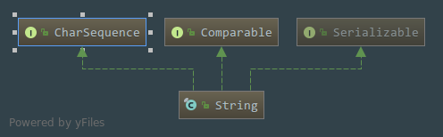
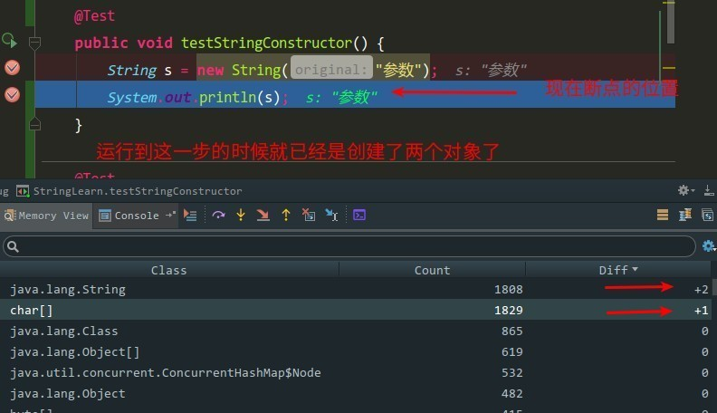

# java.lang.String浅析
## String类的声明
````java
public final class String
    implements java.io.Serializable, Comparable<String>, CharSequence{} 
````

 - `String`类是`Final`类型的,不可变的类,所以是不能被继承的
 - 实现`Serializable`接口说明是支持被序列化以及反序列化
 - 实现`Comparable`接口说明`String`支持被排序
 - 实现`CharSequence`接口是一个可读序列
 - 同时在实现接口的时候使用到了`JDK1.5`的新特性`泛型`
## String类的属性
````java
 /** The value is used for character storage. */
    private final char value[];
````
从这里我们可以看出这是一个`Final`修饰的`character`类型数组,由此我们可以想到`String`不可变的性质应该跟这个有关了,然后`String`也还是**字符数组**
```java
 /** Cache the hash code for the string */
    private int hash; // Default to 0
```
缓存字符串的`HashCode`,默认是为0
```java
 /** use serialVersionUID from JDK 1.0.2 for interoperability */
    private static final long serialVersionUID = -6849794470754667710L;
```
`serialVersionUID`翻译过中文来就是`序列化ID`,在反序列化的时候`JVM`要比较从某种途径传递过来的`字节流`中的`serialVersionUID`跟本地类文件中的`serialVersionUID`是否一制,如果不一致就会反序列化失败
```java
 /**
     * Class String is special cased within the Serialization Stream Protocol.
     * A String instance is written into an ObjectOutputStream according to
     * Object Serialization Specification, Section 6.2, "Stream Elements"</a>
     */
private static final ObjectStreamField[] serialPersistentFields =
        new ObjectStreamField[0];
```
这个属性看名字的话就是跟反序列化有关的,就是说一个String实例来源于输入的字节流中,也就是反序列化中的字节流

## String类的构造方法
  ### 一.  无参的构造方法
  ```java
/**
     * Initializes a newly created  String object so that it represents
     * an empty character sequence.  Note that use of this constructor is
     * unnecessary since Strings are immutable.
     */
    public String() {
        this.value = "".value;
    }
```
当实例化一个`String`对象没有传参数的话,默认就会赋值**一个空白的字符串**,请注意这里不是`NULL`,`String`
```java
   new String()==null   // 这里得到的是false
```

### 二. 传入`String`类型的值实例化,这里初始化流程就是直接把传入的源`String`类型的值中`value`跟`hash`复制给目标`String`类型
 ```java
    public String(String original) {
        this.value = original.value;
        this.hash = original.hash;
    }
    // 这个构造方法就是等于
     String str = new String();     // 直接无参数实例化一个String对象
     String str = new String("");   // 传入一个String类型的值作为参数实例化一个String对象
     // 这两种写法都是可以被编译的,在IDEA中你这样写的话它就会直接提示你这样的方式是多余的，会直接提示你可以优化成下面这种
     String str = "";
     
```
  _这里我又想起来了一个面试题,题目为
  > String str= new String("abc")这里创建了几个对象  
  
  按照我们以往的思路,实例化一个对象有两种方式  
  
  1.直接`new`一个对象出来,例如   A a=new A();  
  
  2.通过反射调用`Class`的`newInstance()`方法创建例如 A a=A.class.newInstance();  
  
  在这道题目中很显然是使用`new`对象的方式创建的,调用的是传入一个`String`类型的字符串进行构建,然后实例化的对象的引用复制给`str`这个变量,所以很显然就等同于有两个对象,所以这里的话应该这样回答比较好一点:
  > 这里涉及到了**2**个`String`对象
  
  一个是`abc`这个字符串驻留在全局共享的字符串常量池里面的实例对象,另一个是`new String()`创建并初始化的,内容跟`abc`一致的实例.直接在`IDEA`里面测试:
  
  
  我们可以留意到这里是有个`char[]`,我们这里并没有显示的出现数组,但是这里却出现了,由此我们应该可以想到,这应该就是构成`String`内容的字符数组了
  

### 三.  只传入一个数组对象,使用这种方法创建String的话,这里会调用` Arrays.copyOf()`方法,` Arrays.copyOf()`方法返回的是`char[]`数组,所以作用就是把这个数组里面的内容复制到`String`的字符串数组里面去
   ```java
   public String(char value[]) {
           this.value = Arrays.copyOf(value, value.length);
       }
   ```
   - 这里还可以传入一个数组指定部分内容去构造一个`String`对象,在传入一个数组对象时,同时传入两个`int`类型的下标,其中`offset`为开始的下标位置,`count`为截取几个数量的数组内容
   ````java
   public String(char value[], int offset, int count) {
           if (offset < 0) {
               // 起始位置小于0的话,肯定就是下标越界，也就是不正确了
               throw new StringIndexOutOfBoundsException(offset);
           }
           if (count <= 0) {
               if (count < 0) {
                  //  截取的内容长度小于0必定也是下标越界
                   throw new StringIndexOutOfBoundsException(count);
               }
               if (offset <= value.length) {
                   this.value = "".value;
                   return;
               }
           }
           // Note: offset or count might be near -1>>>1.
           if (offset > value.length - count) {
               //  起始的位置 > 总长度 - 截取的下标长度 ,这里就是属于截取长度超出数组的总长度了
               throw new StringIndexOutOfBoundsException(offset + count);
           }
           // 复制数组的部分内容到新的数组中
           this.value = Arrays.copyOfRange(value, offset, offset+count);
       }
   ````
  - 
   
    


