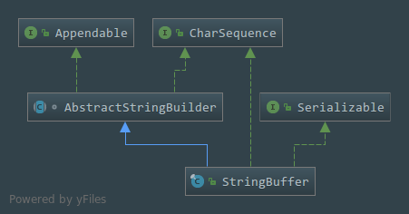

# StringBuffer浅析(JDK1.8)
本质上就是对数组的封装,让更加方便地操作数组,类中很多的方法都只是调用父类`AbstractStringBuffer`中的方法,所以核心代码都不在这个类中,这个类操作是线程安全的
## 一. 类的声明
````java
public final class StringBuffer
    extends AbstractStringBuilder
    implements java.io.Serializable, CharSequence
````

 - `Final`类,不可以被继承和被修改
 - 继承了抽象类`AbstractStringBuffer`,这个类里面有大量的封装字符数组的方法
 - 实现了可序列化接口
 - 实现了字符串队列接口
 
## 二. 类的属性
- 保存字符串的值,隐式的从父类中继承
````java
char[] value;
````

- 字符串长度计数,隐式的从父类中继承   
```java
int count;
```

- 缓存最后一个`toString`的值,当`StringBuffer`被修改的时候被清除,注意这里使用了`transient`关键字进行修饰,说明在反序列化的时候将不会被反序列化,变量将不是反序列化的一部分
````java
private transient char[] toStringCache;
````
---

## 三.类的构造方法

###  ◆◆     无参的构造方法

- 默认实例化一个`StringBuffer`对象,默认就是创建一个长度为**16**的数组
```java
public StringBuffer() {
        super(16);
    }
```
###  ◆◆     有参的构造方法

- 传入一个数组长度,然后创建一个指定长度的数组
```java
public StringBuffer(int capacity) {
        super(capacity);
    }
```

- 传入字符串进行实例化,初始化的数组长度为(**字符串的长度+16**)
````java
public StringBuffer(String str) {
        super(str.length() + 16);
        append(str);
    }
````
- 传入实现了字符序列`CharSequence`接口的实现类,初始化的数组长度为(**字符串的长度+16**)
```java
public StringBuffer(CharSequence seq) {
        this(seq.length() + 16);
        append(seq);
    }
```
---
## 四.方法
- `length()`方法,返回数据的长度,也就是数组对象的长度
```java
 @Override
    public synchronized int length() {
        return count;
    }
```

- `capacity()`返回当前的容量大小
```java
@Override
    public synchronized int capacity() {
        return value.length;
    }
```
- `ensureCapacity()`重新设置数组的容量大小
```java
 @Override
    public synchronized void ensureCapacity(int minimumCapacity) {
        if (minimumCapacity > value.length) {
            expandCapacity(minimumCapacity);
        }
    }
```

- `trimToSize()`减少内存的占用,就是使用`Arrays.copy`把原数组的内容复制到一个新的数组里面去
````java
@Override
    public synchronized void trimToSize() {
        super.trimToSize();
    }
````
- `charAt()`返回指定下标的字符
```java
@Override
    public synchronized char charAt(int index) {
        if ((index < 0) || (index >= count))
            throw new StringIndexOutOfBoundsException(index);
        return value[index];
    }
```

- `setCharAt()`传入指定下标以及要设置的字符内容,替换指定下标的字符内容
```java
 @Override
    public synchronized void setCharAt(int index, char ch) {
        if ((index < 0) || (index >= count))
            throw new StringIndexOutOfBoundsException(index);
        toStringCache = null;
        value[index] = ch;
    }
```
- `setLength()`设置字符序列的长度,传入指定的长度
```java
 @Override
    public synchronized void setLength(int newLength) {
        toStringCache = null;
        super.setLength(newLength);
    }
```
- `append()`方法是一个常用的方法,在这里有十几个重载的方法,可以拼接多种类型的数据,不过主要的操作还是在父类的方法里面
```java
@Override
    public synchronized StringBuffer append(Object obj) {
        toStringCache = null;
        super.append(String.valueOf(obj));
        return this;
    }

    @Override
    public synchronized StringBuffer append(String str) {
        toStringCache = null;
        super.append(str);
        return this;
    }

   
    public synchronized StringBuffer append(StringBuffer sb) {
        toStringCache = null;
        super.append(sb);
        return this;
    }

    
    @Override
    synchronized StringBuffer append(AbstractStringBuilder asb) {
        toStringCache = null;
        super.append(asb);
        return this;
    }

   
    @Override
    public synchronized StringBuffer append(CharSequence s) {
        toStringCache = null;
        super.append(s);
        return this;
    }

   
    @Override
    public synchronized StringBuffer append(CharSequence s, int start, int end)
    {
        toStringCache = null;
        super.append(s, start, end);
        return this;
    }

    @Override
    public synchronized StringBuffer append(char[] str) {
        toStringCache = null;
        super.append(str);
        return this;
    }

    
    @Override
    public synchronized StringBuffer append(char[] str, int offset, int len) {
        toStringCache = null;
        super.append(str, offset, len);
        return this;
    }

    @Override
    public synchronized StringBuffer append(boolean b) {
        toStringCache = null;
        super.append(b);
        return this;
    }

    @Override
    public synchronized StringBuffer append(char c) {
        toStringCache = null;
        super.append(c);
        return this;
    }

    @Override
    public synchronized StringBuffer append(int i) {
        toStringCache = null;
        super.append(i);
        return this;
    }

   
    @Override
    public synchronized StringBuffer appendCodePoint(int codePoint) {
        toStringCache = null;
        super.appendCodePoint(codePoint);
        return this;
    }

    @Override
    public synchronized StringBuffer append(long lng) {
        toStringCache = null;
        super.append(lng);
        return this;
    }

    @Override
    public synchronized StringBuffer append(float f) {
        toStringCache = null;
        super.append(f);
        return this;
    }

    @Override
    public synchronized StringBuffer append(double d) {
        toStringCache = null;
        super.append(d);
        return this;
    }
```
- 指定起始下标跟结束下标删除指定字符
```java
@Override
    public StringBuffer delete(int start, int end) {
        super.delete(start, end);
        return this;
    }
```

- 删除从指定索引的字符
```java
@Override
    public StringBuffer deleteCharAt(int index) {
        super.deleteCharAt(index);
        return this;
    }
```

- 指定起始下标,结束下标,要被替换成的字符串三个参数,替换为指定的字符串
```java
@Override
    public StringBuffer replace(int start, int end, String str) {
        super.replace(start, end, str);
        return this;
    }
```

- 截取指定内容
````java

    @Override
    public synchronized String substring(int start) {
        return substring(start, count);
    }

   
    @Override
    public synchronized CharSequence subSequence(int start, int end) {
        return super.substring(start, end);
    }

   
    @Override
    public synchronized String substring(int start, int end) {
        return super.substring(start, end);
    }

````
- `insert()`方法也是被重载了很多遍,用于插入新的字符,反正怎么重载都是都是那几个参数,也是可以插入很多种类型的数据,主要的操作也是在父类中的方法里面
```java

    @Override
    public synchronized StringBuffer insert(int index, char[] str, int offset,
                                            int len)
    {
        toStringCache = null;
        super.insert(index, str, offset, len);
        return this;
    }

   
    @Override
    public synchronized StringBuffer insert(int offset, Object obj) {
        toStringCache = null;
        super.insert(offset, String.valueOf(obj));
        return this;
    }

    
    @Override
    public synchronized StringBuffer insert(int offset, String str) {
        toStringCache = null;
        super.insert(offset, str);
        return this;
    }

   
    @Override
    public synchronized StringBuffer insert(int offset, char[] str) {
        toStringCache = null;
        super.insert(offset, str);
        return this;
    }

    
    @Override
    public StringBuffer insert(int dstOffset, CharSequence s) {
        // Note, synchronization achieved via invocations of other StringBuffer methods
        // after narrowing of s to specific type
        // Ditto for toStringCache clearing
        super.insert(dstOffset, s);
        return this;
    }

   
    @Override
    public synchronized StringBuffer insert(int dstOffset, CharSequence s,
            int start, int end)
    {
        toStringCache = null;
        super.insert(dstOffset, s, start, end);
        return this;
    }

   
    @Override
    public  StringBuffer insert(int offset, boolean b) {
        // Note, synchronization achieved via invocation of StringBuffer insert(int, String)
        // after conversion of b to String by super class method
        // Ditto for toStringCache clearing
        super.insert(offset, b);
        return this;
    }

   
    @Override
    public synchronized StringBuffer insert(int offset, char c) {
        toStringCache = null;
        super.insert(offset, c);
        return this;
    }

   
    @Override
    public StringBuffer insert(int offset, int i) {
        // Note, synchronization achieved via invocation of StringBuffer insert(int, String)
        // after conversion of i to String by super class method
        // Ditto for toStringCache clearing
        super.insert(offset, i);
        return this;
    }

   
    @Override
    public StringBuffer insert(int offset, long l) {
        // Note, synchronization achieved via invocation of StringBuffer insert(int, String)
        // after conversion of l to String by super class method
        // Ditto for toStringCache clearing
        super.insert(offset, l);
        return this;
    }

   
    @Override
    public StringBuffer insert(int offset, float f) {
        // Note, synchronization achieved via invocation of StringBuffer insert(int, String)
        // after conversion of f to String by super class method
        // Ditto for toStringCache clearing
        super.insert(offset, f);
        return this;
    }

 
    @Override
    public StringBuffer insert(int offset, double d) {
        // Note, synchronization achieved via invocation of StringBuffer insert(int, String)
        // after conversion of d to String by super class method
        // Ditto for toStringCache clearing
        super.insert(offset, d);
        return this;
    }
```
- 判断字符串中是否含有指定字符,然后返回下标
```java
    @Override
    public synchronized int indexOf(String str) {
        return super.indexOf(str);
    }

    @Override
    public synchronized  int indexOf(String str, int fromIndex) {
        return super.indexOf(str, fromIndex);
    }

    @Override
    public synchronized  int lastIndexOf(String str) {
        return super.lastIndexOf(str);
    }

    @Override
    public synchronized  int lastIndexOf(String str, int fromIndex) {
        return super.lastIndexOf(str, fromIndex);
    }
```

- 反转字符串
```java
    @Override
    public synchronized StringBuffer reverse() {
        toStringCache = null;
        super.reverse();
        return this;
    }
```

- `toString()`方法,就是重新生成了一个`String`对象,然后把数组的值跟长度传过去拷贝过去
```java
     @Override
     public synchronized String toString() {
         if (toStringCache == null) {
             toStringCache = Arrays.copyOfRange(value, 0, count);
         }
         return new String(toStringCache, true);
     }
```

- 两个我自己都没见过的方法,不过看注释的话`writeObject()`就是保存一个实例到流的状态,`readObject()`从流状态中恢复为一个`StringBuffer`对象
```java
    private synchronized void writeObject(java.io.ObjectOutputStream s)
            throws java.io.IOException {
            java.io.ObjectOutputStream.PutField fields = s.putFields();
            fields.put("value", value);
            fields.put("count", count);
            fields.put("shared", false);
            s.writeFields();
        }

   
   private void readObject(java.io.ObjectInputStream s)
           throws java.io.IOException, ClassNotFoundException {
           java.io.ObjectInputStream.GetField fields = s.readFields();
           value = (char[])fields.get("value", null);
           count = fields.get("count", 0);
       }
```


