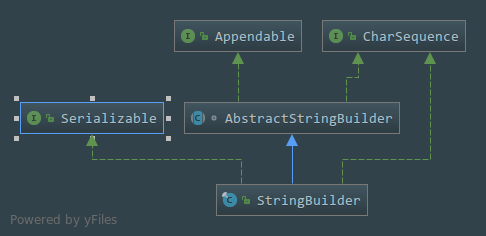

# StringBuilder浅析(JDK1.8)
本质上就是对数组的封装,让我们可以更加方便地操作数组,类中很多的方法都只是调用父类`AbstractStringBuilder`中的方法,所以核心代码都不在这个类中
## 一. 类的声明
````java
public final class StringBuilder
    extends AbstractStringBuilder
    implements java.io.Serializable, CharSequence{}
````

 - `Final`类,不可以被继承和被修改
 - 继承了抽象类`AbstractStringBuilder`,这个类里面有大量的封装字符数组的方法
 - 实现了可序列化接口
 
## 二. 类的属性
- 保存字符串的值,隐式的从父类中继承
````java
char[] value;
````

- 字符串长度计数,隐式的从父类中继承   
```java
int count;
```
---

## 三.类的构造方法

###  ◆◆     无参的构造方法

- 默认实例化一个`StringBuilder`对象,默认就是创建一个长度为**16**的数组
```java
public StringBuilder() {
        super(16);
    }
```
###  ◆◆     有参的构造方法

- 传入一个数组长度,然后创建一个指定长度的数组
```java
public StringBuilder(int capacity) {
        super(capacity);
    }
```

- 传入字符串进行实例化,初始化的数组长度为(**字符串的长度+16**)
````java
public StringBuilder(String str) {
        super(str.length() + 16);
        append(str);
    }
````
- 传入实现了字符序列`CharSequence`接口的实现类,初始化的数组长度为(**字符串的长度+16**)
```java
public StringBuilder(CharSequence seq) {
        this(seq.length() + 16);
        append(seq);
    }
```
---
## 四.方法
- `append()`方法是一个常用的方法,在这里有十几个重载的方法,可以拼接多种类型的数据,不过主要的操作还是在父类的方法里面
```java
@Override
    public StringBuilder append(Object obj) {
        return append(String.valueOf(obj));
    }

    @Override
    public StringBuilder append(String str) {
        super.append(str);
        return this;
    }

  
    public StringBuilder append(StringBuffer sb) {
        super.append(sb);
        return this;
    }

    @Override
    public StringBuilder append(CharSequence s) {
        super.append(s);
        return this;
    }

   
    @Override
    public StringBuilder append(CharSequence s, int start, int end) {
        super.append(s, start, end);
        return this;
    }

    @Override
    public StringBuilder append(char[] str) {
        super.append(str);
        return this;
    }

   
    @Override
    public StringBuilder append(char[] str, int offset, int len) {
        super.append(str, offset, len);
        return this;
    }

    @Override
    public StringBuilder append(boolean b) {
        super.append(b);
        return this;
    }

    @Override
    public StringBuilder append(char c) {
        super.append(c);
        return this;
    }

    @Override
    public StringBuilder append(int i) {
        super.append(i);
        return this;
    }

    @Override
    public StringBuilder append(long lng) {
        super.append(lng);
        return this;
    }

    @Override
    public StringBuilder append(float f) {
        super.append(f);
        return this;
    }

    @Override
    public StringBuilder append(double d) {
        super.append(d);
        return this;
    }
```
- 指定起始下标跟结束下标删除指定字符
```java
@Override
    public StringBuilder delete(int start, int end) {
        super.delete(start, end);
        return this;
    }
```

- 删除从指定索引的字符
```java
@Override
    public StringBuilder deleteCharAt(int index) {
        super.deleteCharAt(index);
        return this;
    }
```

- 指定起始下标,结束下标,要被替换成的字符串三个参数,替换为指定的字符串
```java
@Override
    public StringBuilder replace(int start, int end, String str) {
        super.replace(start, end, str);
        return this;
    }
```
- `insert()`方法也是被重载了很多遍,用于插入新的字符,反正怎么重载都是都是那几个参数,也是可以插入很多种类型的数据,主要的操作也是在父类中的方法里面
```java

    @Override
    public StringBuilder insert(int index, char[] str, int offset,
                                int len)
    {
        super.insert(index, str, offset, len);
        return this;
    }

    
    @Override
    public StringBuilder insert(int offset, Object obj) {
            super.insert(offset, obj);
            return this;
    }

    
    @Override
    public StringBuilder insert(int offset, String str) {
        super.insert(offset, str);
        return this;
    }

    
    @Override
    public StringBuilder insert(int offset, char[] str) {
        super.insert(offset, str);
        return this;
    }

   
    @Override
    public StringBuilder insert(int dstOffset, CharSequence s) {
            super.insert(dstOffset, s);
            return this;
    }

    
    @Override
    public StringBuilder insert(int dstOffset, CharSequence s,
                                int start, int end)
    {
        super.insert(dstOffset, s, start, end);
        return this;
    }

    
    @Override
    public StringBuilder insert(int offset, boolean b) {
        super.insert(offset, b);
        return this;
    }

   
    @Override
    public StringBuilder insert(int offset, char c) {
        super.insert(offset, c);
        return this;
    }

   
    @Override
    public StringBuilder insert(int offset, int i) {
        super.insert(offset, i);
        return this;
    }

   
    @Override
    public StringBuilder insert(int offset, long l) {
        super.insert(offset, l);
        return this;
    }

   
    @Override
    public StringBuilder insert(int offset, float f) {
        super.insert(offset, f);
        return this;
    }

   
    @Override
    public StringBuilder insert(int offset, double d) {
        super.insert(offset, d);
        return this;
    }
    
```
- 判断字符串中是否含有指定字符,然后返回下标
```java
@Override
    public int indexOf(String str) {
        return super.indexOf(str);
    }

    @Override
    public int indexOf(String str, int fromIndex) {
        return super.indexOf(str, fromIndex);
    }

    @Override
    public int lastIndexOf(String str) {
        return super.lastIndexOf(str);
    }

    @Override
    public int lastIndexOf(String str, int fromIndex) {
        return super.lastIndexOf(str, fromIndex);
    }
```

- 反转字符串
```java
@Override
    public StringBuilder reverse() {
        super.reverse();
        return this;
    }
```

- `toString()`方法,就是重新生成了一个`String`对象,然后把数组的值跟长度传过去拷贝过去
```java
 @Override
    public String toString() {
        // Create a copy, don't share the array
        return new String(value, 0, count);
    }
```

- 两个我自己都没见过的方法,不过看注释的话`writeObject()`就是保存一个实例到流的状态,`readObject()`从流状态中恢复为一个`StringBuffer`对象
```java
    private void writeObject(java.io.ObjectOutputStream s)
          throws java.io.IOException {
          s.defaultWriteObject();
          s.writeInt(count);
          s.writeObject(value);
      }

   
    private void readObject(java.io.ObjectInputStream s)
        throws java.io.IOException, ClassNotFoundException {
        s.defaultReadObject();
        count = s.readInt();
        value = (char[]) s.readObject();
    }
```


