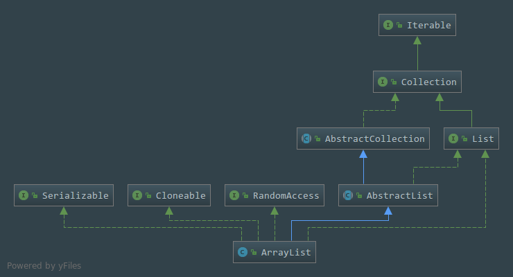

# 浅析ArrayList(JDK1.8)
## 一. ArrayList类的声明
````java
public class ArrayList<E> extends AbstractList<E>
        implements List<E>, RandomAccess, Cloneable, java.io.Serializable
````

 - 继承了`AbstractList`父类,父类里面已经有了基本的增删改查的方法了
 - 实现了`List`接口,这里相当于一个数组队列了,通俗点就是动态数组,长度是可以随时扩展的
 - 实现了`RandomAccess`接口,这个接口是专门为`List`实现的,实现了这个接口表明是支持快速随机访问的,这个接口里面没有定义任何方法
 - 实现`Cloneable`接口,表明了这个类是支持被克隆的,因为覆盖了`clone()`方法
 - 实现了`Serializable`接口,支持序列化差均属以及反序列化传输
## 二. 类的属性
- 默认的数组容量大小就是10  
```java
private static final int DEFAULT_CAPACITY = 10;
```
- 空的常量数组
```java
    private static final Object[] EMPTY_ELEMENTDATA = {};
```
- 默认空的常量数组
 ```java
    private static final Object[] DEFAULTCAPACITY_EMPTY_ELEMENTDATA = {};
```
- 存放数据的数组,所以ArrayList底层实现还是数组,任何空的ArrayList中的``with elementData == DEFAULTCAPACITY_EMPTY_ELEMENTDATA``,这个属性算是本类里面最核心的属性了,大部分的方法都是在操作这个属性    
```java
    transient Object[] elementData; // non-private to simplify nested class access
````
- 分配数组的最大长度值
```java
 private static final int MAX_ARRAY_SIZE = Integer.MAX_VALUE - 8;
```

- 数组中元素的大小
````java
    private int size;
````

---

## 三.类的构造方法

- ###       无参的构造方法

```java
    /**
     * Constructs an empty list with an initial capacity of ten.
     * 注意这个方法的注释,在JDK8以前的方法体是this(10),也就是默认就是默认初始化容量大小为10的数组,但是到了JKD8中被替换成了this.elementData = DEFAULTCAPACITY_EMPTY_ELEMENTDATA,在论坛上找到据说是惰性初始化
     */
public ArrayList() {
        // 默认无参实例化就是默认空的常量数组
        this.elementData = DEFAULTCAPACITY_EMPTY_ELEMENTDATA;
    }
```
- ###       有参的构造方法
- 传入int类型的数值指定初始化数组容量大小
```java
public ArrayList(int initialCapacity) {
        // 如果容量大小大于0的话说明是个合法的数据,就初始化该大小的一个Object数组
        if (initialCapacity > 0) {
            this.elementData = new Object[initialCapacity];
        // 容量大小为0的话就是等于空的常量数组
        } else if (initialCapacity == 0) {
            this.elementData = EMPTY_ELEMENTDATA;
        // 其他的可能就是一个不合法的容量大小了
        } else {
            throw new IllegalArgumentException("Illegal Capacity: "+
                                               initialCapacity);
        }
    }
```
- 传入一个实现了`Collection`接口的类型数据,使用泛型限制了数据类型
````java
public ArrayList(Collection<? extends E> c) {
       // 把该类型转换为一个Object数组类型
        elementData = c.toArray();
        // 把上面转换到的Object数组的长度复制给ArrayList中的size属性,然后判断是否等于0
        
        
        if ((size = elementData.length) != 0) {
            // c.toArray might (incorrectly) not return Object[] (see 6260652)
            // 如果数组数据类型不等于Object的话就转换成一个Object类型的数组
            if (elementData.getClass() != Object[].class)
                elementData = Arrays.copyOf(elementData, size, Object[].class);
        } else {
            // replace with empty array.
            this.elementData = EMPTY_ELEMENTDATA;
        }
    }
````

---
## 四.方法

- trimToSize方法,设置当前数组的长度为当前数组元素的长度,可以减少内存的占用
```java
 public void trimToSize() {
        modCount++;
        if (size < elementData.length) {
            elementData = (size == 0)
              ? EMPTY_ELEMENTDATA
              : Arrays.copyOf(elementData, size);
        }
    }
```

- ensureCapacity方法,供外部使用的调整数组容量大小的方法,若当前的容量不足以容纳当前所有的元素的话就进行扩充
````java
public void ensureCapacity(int minCapacity) {
        // 首先判断集合里面的数据是否为空,为空最小扩充值为0,否则就是默认的容量大小,也就是10
        int minExpand = (elementData != DEFAULTCAPACITY_EMPTY_ELEMENTDATA)
            // any size if not default element table
            ? 0
            // larger than default for default empty table. It's already
            // supposed to be at default size.
            : DEFAULT_CAPACITY;
        
       // 如果当前所有元素的长度大于当前数组的长度,也就是大于最小要被扩容的长度的时候就进行扩容
        if (minCapacity > minExpand) {
            ensureExplicitCapacity(minCapacity);
        }
    }
````

- ensureExplicitCapacity方法,一个类的私有的方法,确定一个明确的容量
````java
   private void ensureExplicitCapacity(int minCapacity) {
        //  修改统计次数+1
        modCount++;

        // overflow-conscious code
        // 需要检查的最小的容量值- 元素数据的长度 大于0,就进行扩充操作
        if (minCapacity - elementData.length > 0)
            grow(minCapacity);
    }
````

- ensureCapacityInternal方法,供类内部使用的一个判断容量是否溢出的方法
````java
private void ensureCapacityInternal(int minCapacity) {
        if (elementData == DEFAULTCAPACITY_EMPTY_ELEMENTDATA) {
             // 返回默认的容量值跟需要检查的最小容量值中间更大的那个数
            minCapacity = Math.max(DEFAULT_CAPACITY, minCapacity);
        }
        
        ensureExplicitCapacity(minCapacity);
    }
````

- grow方法,用于扩充数组的长度的方法
```java
private void grow(int minCapacity) {
        // overflow-conscious code
        // 老的容量值应该是数组数据长度的值
        int oldCapacity = elementData.length;
        // 新的容量值是老的容量值加上老的容量值右移一位,也就是相当于是除以2,也就是相当于(1+（1/2）),就是扩容1.5倍,简单地理解就是左移是乘,右移是除,不过其实也不是这样,这里牵扯到二进制的运算,什么最高位,空格位之类的,又想起来了51单片机中的汇编来了。。。。
        int newCapacity = oldCapacity + (oldCapacity >> 1);
        // 信的容量-最小检查的容量小于0就说明最小检查容量更大,欣荣亮亮就等于最小检查容量
        if (newCapacity - minCapacity < 0)
            newCapacity = minCapacity;
        // MAX_ARRAY_SIZE的值是2147483639,这个值就是一开始的一个属性,值为Integer的最大值-8,如果新容量-最大的数组长度值大于0的话,就调用hugeCapacity方法处理
        if (newCapacity - MAX_ARRAY_SIZE > 0)
            newCapacity = hugeCapacity(minCapacity);
        // minCapacity is usually close to size, so this is a win:
        // 把原来的数组内容复制到新的数组里面去,实现数组的动态扩容
        elementData = Arrays.copyOf(elementData, newCapacity);
    }
```

- hugeCapacity方法,检查数组长度是否存在溢出情况
````java
private static int hugeCapacity(int minCapacity) {
      // 最小检查容量都小于0了就肯定要溢出了
        if (minCapacity < 0) // overflow
            throw new OutOfMemoryError();
        // 超过这个值就设置数组长度为Integer的最大值,否则就是MAX_ARRAY_SIZE的值,也就是是2147483639
        return (minCapacity > MAX_ARRAY_SIZE) ?
            Integer.MAX_VALUE :
            MAX_ARRAY_SIZE;
    }
````

- toArray方法,讲集合转换为原声Object数组,这个方法是连接集合跟数组间的一个桥梁
```java
public Object[] toArray() {
        return Arrays.copyOf(elementData, size);
    }
```

- get方法,指定下标获取元素

```java
public E get(int index) {
    // 检查下标是否合法
        rangeCheck(index);

        return elementData(index);
    }
```

- set方法,设置指定下标的元素内容
```java
public E set(int index, E element) {
        // 进行下标的范围检测,是否合理
        rangeCheck(index);
         
        E oldValue = elementData(index);
        elementData[index] = element;
        return oldValue;
    }
```

- 添加相关的方法,添加元素到集合里面去
```java
     // 不指定下标添加元素,默认就是在最尾部添加
    public boolean add(E e) {
       // 调整容量
        ensureCapacityInternal(size + 1);  // Increments modCount!!
        // 使用数组的方法设置元素,其中数组的长度以及扩充+1了,所以size++就是数组的最后一个位置
        elementData[size++] = e;
        return true;
    }

     // 这个方法就是指定下标进行插入,这样插入的话后面的元素都要往后移动,其实也就是一个复制到新数组的流程
    public void add(int index, E element) {
      // 检查下标是否合理
        rangeCheckForAdd(index);
        // 调整容量
        ensureCapacityInternal(size + 1);  // Increments modCount!!
        // 把内容复制到新数组里面去,但是把插入位置后的数据往后移动一位
        System.arraycopy(elementData, index, elementData, index + 1,
                         size - index);
         // 使用数组的方法设置下标位置对应的数组内容                
        elementData[index] = element;
        size++;
    }
    
    // 丢一个集合进来,然后添加进去
    public boolean addAll(Collection<? extends E> c) {
           //  把集合转换为数组
            Object[] a = c.toArray();
            // 获取将要被新添加的元素的个数
            int numNew = a.length;
            // 调用容量检测,检测是否需要进行扩容
            ensureCapacityInternal(size + numNew);  // Increments modCount
            // 复制到新数组中
            System.arraycopy(a, 0, elementData, size, numNew);
            // 添加完后集合的大小就是原大小+新添加的元素个数之和
            size += numNew;
            // 新添加的元素不为0就说明添加成功了,返回true
            return numNew != 0;
        }
    
       // 丢进一个集合进来在指定下标插入
        public boolean addAll(int index, Collection<? extends E> c) {
            // 检测要被添加的下标位置是否合理
            rangeCheckForAdd(index);
            // 把集合转换为数组
            Object[] a = c.toArray();
            int numNew = a.length;
            // 检测是否需要调整数组的容量
            ensureCapacityInternal(size + numNew);  // Increments modCount
            // 计算出要要往右移动的位置
            int numMoved = size - index;
            if (numMoved > 0)
                System.arraycopy(elementData, index, elementData, index + numNew,
                                 numMoved);
        
            System.arraycopy(a, 0, elementData, index, numNew);
            size += numNew;
            // 不等于0就是新增成功了
            return numNew != 0;
        }
```

-  删除相关的方法,移除集合里面指定的元素
````java
   // 通过指定下标移除指定下标的元素,移除后被移除元素右边的元素将会向左移动
      public E remove(int index) {
        rangeCheck(index);
        // 修改次数+1
        modCount++;
        E oldValue = elementData(index);
        // 让元素挨个往左移动一位
        int numMoved = size - index - 1;
        if (numMoved > 0)
            System.arraycopy(elementData, index+1, elementData, index,
                             numMoved);
        // 把原来数组里面的最后一个元素删除  --size自减
        elementData[--size] = null; // clear to let GC do its work

        return oldValue;
    }

   // 删除指定的元素
    public boolean remove(Object o) {
        if (o == null) {
            // 把所有的元素遍历一遍,验证是否有该元素,这里猜得出肯定很慢的
            for (int index = 0; index < size; index++)
                // 循环到某下标的值为null就说明遍历到了就return跳出循环
                if (elementData[index] == null) {
                   // 调用一个快速移除方法
                    fastRemove(index);
                    return true;
                }
        } else {
            // 依旧是遍历所有的元素,如果两个Object元素使用equals比较相等就说明是相等了
            for (int index = 0; index < size; index++)
                if (o.equals(elementData[index])) {
                    fastRemove(index);
                    return true;
                }
        }
        return false;
    }

    
    // 一个私有的移除方法,跳过了越界检查,并且不返回被删除的值
    private void fastRemove(int index) {
        modCount++;
        int numMoved = size - index - 1;
        if (numMoved > 0)
            System.arraycopy(elementData, index+1, elementData, index,
                             numMoved);
        elementData[--size] = null; // clear to let GC do its work
    }
    
    // 清除集合里面所有的元素,原理就是把所有的下标元素值置为null,这个就会被回收
    public void clear() {
            modCount++;
    
            // clear to let GC do its work
            for (int i = 0; i < size; i++)
                elementData[i] = null;
    
            size = 0;
        }
     // 顾名思义就是移除两个指定下标的元素了   
     protected void removeRange(int fromIndex, int toIndex) {
             modCount++;
             int numMoved = size - toIndex;
             System.arraycopy(elementData, toIndex, elementData, fromIndex,
                              numMoved);
     
             // clear to let GC do its work
             int newSize = size - (toIndex-fromIndex);
             for (int i = newSize; i < size; i++) {
                 elementData[i] = null;
             }
             size = newSize;
         }
         
      // 移除包含指定集合的所有元素   
     public boolean removeAll(Collection<?> c) {
             // 调用一个非空的判断方法,如果为null就抛出异常,程序将无法继续执行
             Objects.requireNonNull(c);
             // 调用批量移除这个方法进行移除
             return batchRemove(c, false);
         }    
     
     // 保留指定的集合元素,其他的被移除    
     public boolean retainAll(Collection<?> c) {
             // 调用一个非空的判断方法,如果为null就抛出异常,程序将无法继续执行
             Objects.requireNonNull(c);
             // 调用批量移除这个方法进行移除
             return batchRemove(c, true);
         }
       
     // 批量移除方法,比较的复杂    
     private boolean batchRemove(Collection<?> c, boolean complement) {
             final Object[] elementData = this.elementData;
             int r = 0, w = 0;
             boolean modified = false;
             try {
                 for (; r < size; r++)
                     // 判断集合里面是否包含之歌元素,然后根据complement的值决定是否往前删除
                     if (c.contains(elementData[r]) == complement)
                         elementData[w++] = elementData[r];
             } finally {
                 // Preserve behavioral compatibility with AbstractCollection,
                 // even if c.contains() throws.
                 if (r != size) {
                     // 发生了异常就把r后面的元素复制到w前面去
                     System.arraycopy(elementData, r,
                                      elementData, w,
                                      size - r);
                     w += size - r;
                 }
                 if (w != size) {
                     // clear to let GC do its work
                     // 清楚这些元素,置空让JVM回收
                     for (int i = w; i < size; i++)
                         elementData[i] = null;
                     modCount += size - w;
                     size = w;
                     modified = true;
                 }
             }
             return modified;
         }    
````


- 检查容量的一些方法
````java
    // 普通得到范围检测
    private void rangeCheck(int index) {
        if (index >= size)
            throw new IndexOutOfBoundsException(outOfBoundsMsg(index));
    }

    // 添加元素的时候进行范围检测
    private void rangeCheckForAdd(int index) {
        if (index > size || index < 0)
            throw new IndexOutOfBoundsException(outOfBoundsMsg(index));
    }

    // 索引超出异常消息
    private String outOfBoundsMsg(int index) {
        return "Index: "+index+", Size: "+size;
    }
````

- 迭代元素的方法
````java

   public ListIterator<E> listIterator(int index) {
        if (index < 0 || index > size)
            throw new IndexOutOfBoundsException("Index: "+index);
        return new ListItr(index);
    }

   
    public ListIterator<E> listIterator() {
        return new ListItr(0);
    }

   
    public Iterator<E> iterator() {
        return new Itr();
    }
````

- 手动序列化以及反序列化方法
````java

    private void writeObject(java.io.ObjectOutputStream s)
        throws java.io.IOException{
        // Write out element count, and any hidden stuff
        int expectedModCount = modCount;
        s.defaultWriteObject();

        // Write out size as capacity for behavioural compatibility with clone()
        s.writeInt(size);

        // Write out all elements in the proper order.
        for (int i=0; i<size; i++) {
            s.writeObject(elementData[i]);
        }

        if (modCount != expectedModCount) {
            throw new ConcurrentModificationException();
        }
    }

   
    private void readObject(java.io.ObjectInputStream s)
        throws java.io.IOException, ClassNotFoundException {
        elementData = EMPTY_ELEMENTDATA;

        // Read in size, and any hidden stuff
        s.defaultReadObject();

        // Read in capacity
        s.readInt(); // ignored

        if (size > 0) {
            // be like clone(), allocate array based upon size not capacity
            ensureCapacityInternal(size);

            Object[] a = elementData;
            // Read in all elements in the proper order.
            for (int i=0; i<size; i++) {
                a[i] = s.readObject();
            }
        }
    }
````


